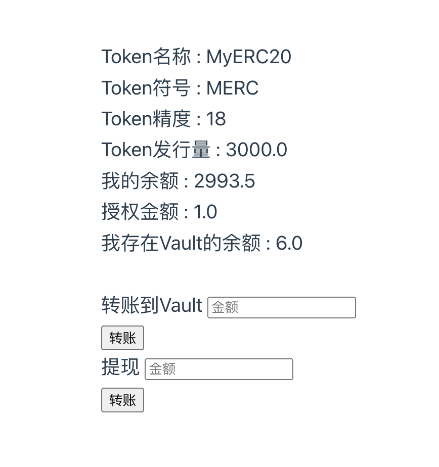

## 发行一个ERC20
### 相关代码
- [发行一个ERC20](https://github.com/leoliew/blockchain-learn/blob/main/w3_1_code/contracts/contracts/MyERC20.sol)
- [可动态增发](https://github.com/leoliew/blockchain-learn/blob/main/w3_1_code/contracts/scripts/myERC20Mint.js)
- [调用合约进行转账](https://github.com/leoliew/blockchain-learn/blob/main/w3_1_code/contracts/scripts/myERC20Transfer.js)

### 相关截图
- 发行一个ERC20

- 可动态增发

- 调用合约进行转账

## Vault
### 相关代码
- [Vault合约](https://github.com/leoliew/blockchain-learn/blob/main/w3_1_code/contracts/contracts/Vault.sol)

### 相关截图

