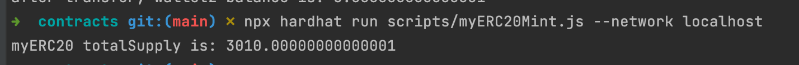

# Basic Sample Hardhat Project

This project demonstrates a basic Hardhat use case. It comes with a sample contract, a test for that contract, a sample script that deploys that contract, and an example of a task implementation, which simply lists the available accounts.

Try running some of the following tasks:

```shell
npx hardhat accounts
npx hardhat compile
npx hardhat clean
npx hardhat test
npx hardhat node
node scripts/sample-script.js
npx hardhat help
```

## 相关代码
- [发行一个ERC20]()
- [可动态增发]()
- [调用合约进行转账]()

## 相关截图
### ERC20
- 发行一个ERC20

- 可动态增发

- 调用合约进行转账


### Vault