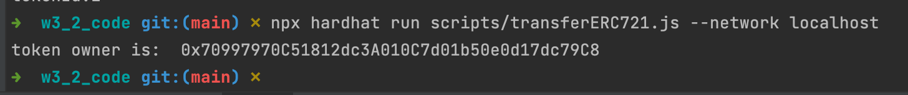
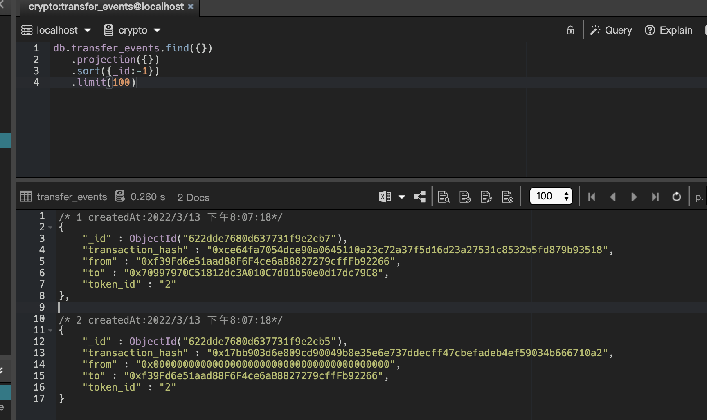

## 发行一个 ERC721 Token

### 相关代码
- [ERC721 Token](https://github.com/leoliew/blockchain-learn/blob/main/w3_2_code/contracts/MyERC721.sol)
- [代币进行转移](https://github.com/leoliew/blockchain-learn/blob/main/w3_2_code/scripts/transferERC721.js)
- [记录事件到数据库](https://github.com/leoliew/blockchain-learn/blob/main/w3_2_code/scripts/saveLogToDB.js)

### 截图
- 代币进行转移
  

- 记录事件到数据库
  