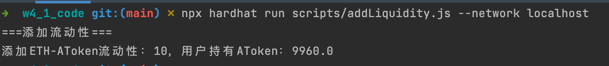
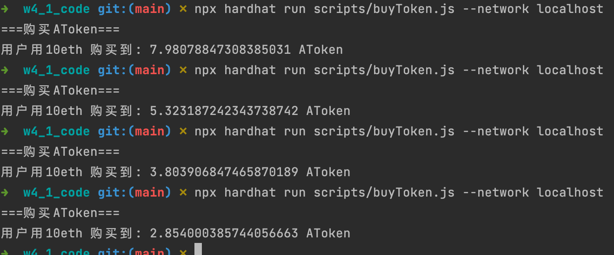

## 相关代码
- [MyTokenMarket](https://github.com/leoliew/blockchain-learn/blob/main/w4_1_code/contracts/MyTokenMarket.sol)
- [addLiquidity](https://github.com/leoliew/blockchain-learn/blob/main/w4_1_code/scripts/addLiquidity.js)
- [buyToken](https://github.com/leoliew/blockchain-learn/blob/main/w4_1_code/scripts/buyToken.js)

## 截图
- addLiquidity

- buyToken
