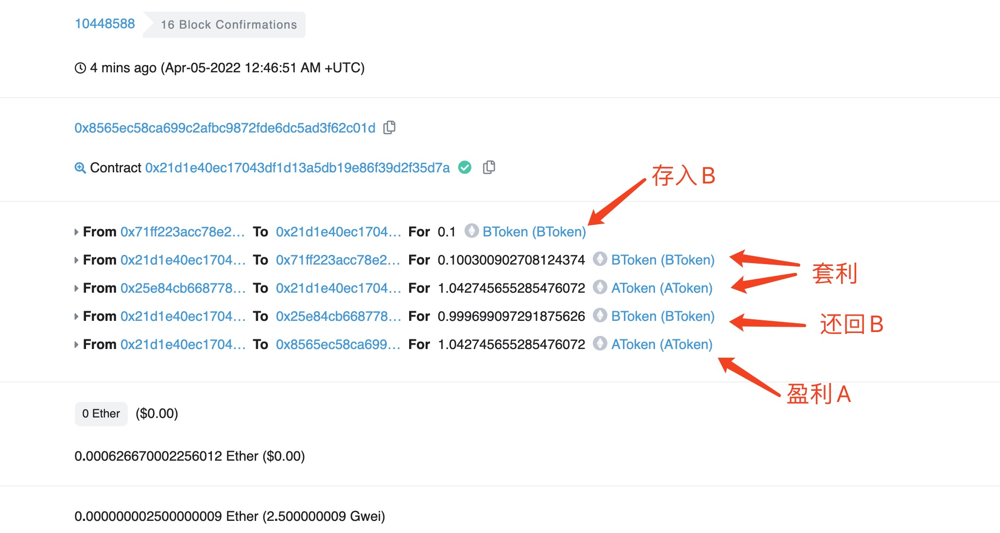
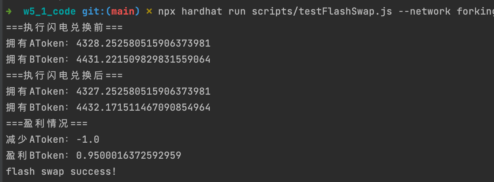

## 测试
- 部署 TokenA,TokenB 到测试网
- 使用 forking network 模拟 rinkeby 的情况，然后部署到 rinkeby 网络进行测试
  - `npx hardhat node --fork ${RINKEBY_ALCHEMY_URL}`

## 交易
- [0x29320ab1d4834b76cfc0d7fa52567678eb94b9e6e4f536269a3f58c77a459b9b](https://rinkeby.etherscan.io/tx/0x29320ab1d4834b76cfc0d7fa52567678eb94b9e6e4f536269a3f58c77a459b9b)

## 相关代码
- [FlashSwap](https://github.com/leoliew/blockchain-learn/blob/main/w5_1_code/contracts/FlashSwap.sol)
- [testFlashSwap](https://github.com/leoliew/blockchain-learn/blob/main/w5_1_code/scripts/testFlashSwap.js)

## 截图
- 测试网测试

- 本地调试

