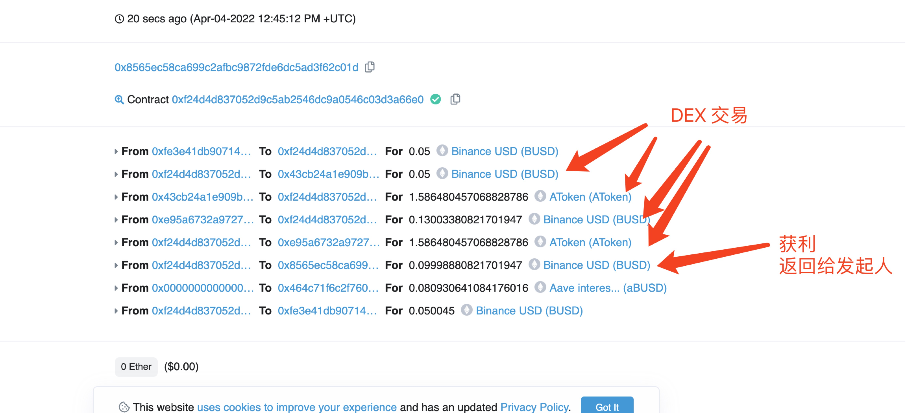
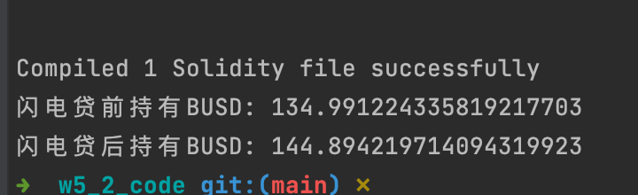
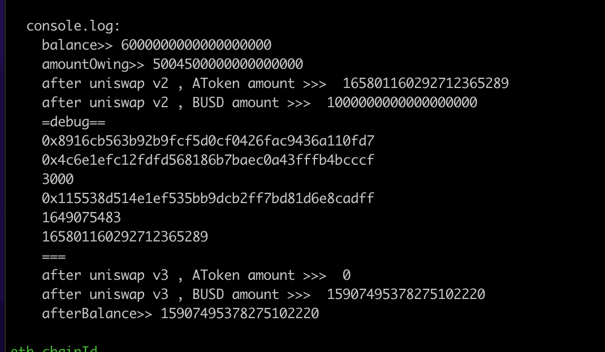

## 测试
- 先往 aave 合约存入 busd，用于支付借贷产生的利息，然后进行借贷

## 交易流水
[0xfb7f2ae1d852fb0b1a4a931abe443dcfe15ec852a3c3575d10cc37d203c28fe1](https://kovan.etherscan.io/tx/0xfb7f2ae1d852fb0b1a4a931abe443dcfe15ec852a3c3575d10cc37d203c28fe1)

## 相关代码
- [AaveFlashLoan](https://github.com/leoliew/blockchain-learn/blob/main/w5_2_code/contracts/AaveFlashLoan.sol)
- [testFlashLoan](https://github.com/leoliew/blockchain-learn/blob/main/w5_2_code/scripts/testFlashLoan.js)

## 截图
- 测试网执行

- 本地调试

