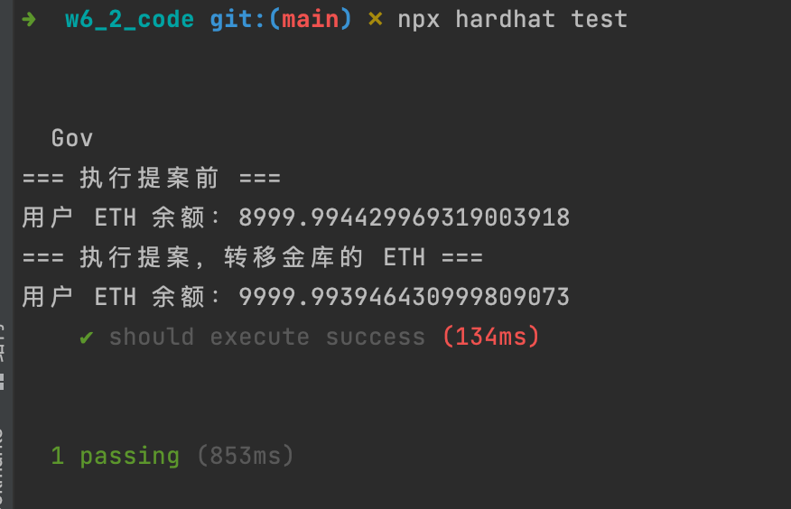
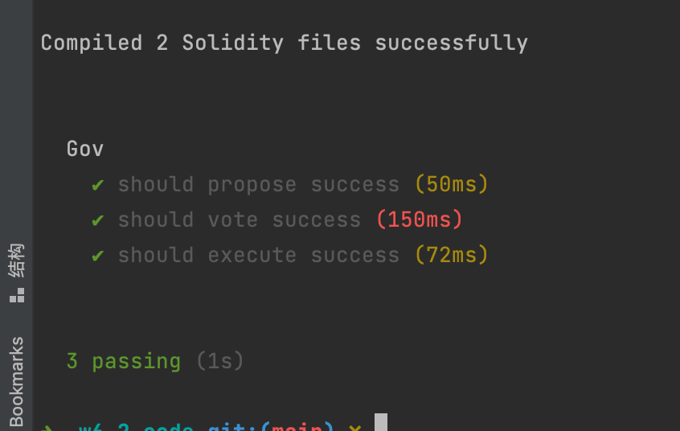

## 相关代码
- [Gov](https://github.com/leoliew/blockchain-learn/blob/main/w6_2_code/contracts/Gov.sol)
- [治理Token](https://github.com/leoliew/blockchain-learn/blob/main/w6_2_code/contracts/Token.sol)
- [Treasury](https://github.com/leoliew/blockchain-learn/blob/main/w6_2_code/contracts/Treasury.sol)
- [单元测试](https://github.com/leoliew/blockchain-learn/blob/main/w6_2_code/test/Gov.test.js)

## 截图
- 执行提案，提现 ETH 到当前账户

- 整体单元测试执行情况

